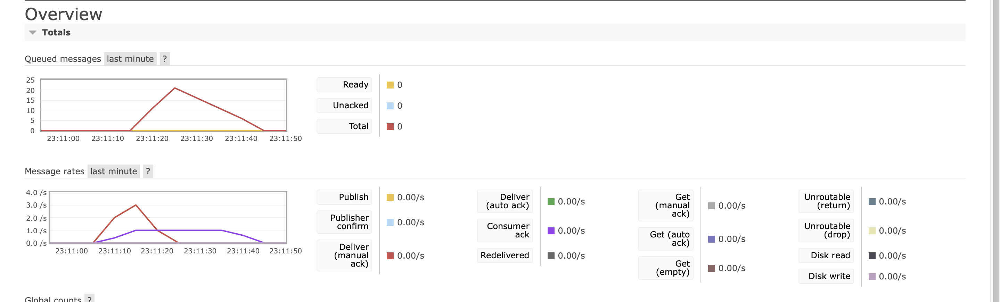
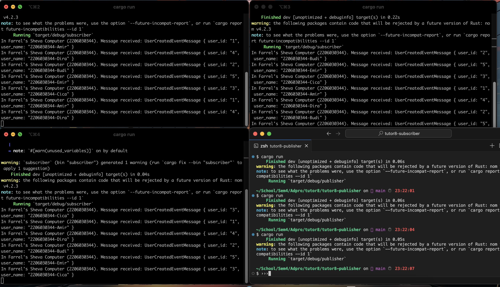
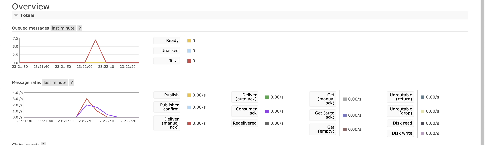

### Questions 
1. what is *amqp*?
amqp atau Advanced Message Queuing Protocol adalah sebuah application layer protocol untuk middleware yang message-oriented. Tujuan utamanya adalah untuk mengirimkan pesan antar aplikasi atau sistem dengan efisien dan aman.

2. what it means? guest:guest@localhost:5672 , what is the first quest, and what is the second guest, and what is localhost:5672 is for?

guest:guest@localhost:5672 adalah sebuah URI koneksi yang digunakan pada messaging protocol seperti amqp. setiap bagian dari URI tersebut memiliki arti sebagai berikut:
- guest: merupakan username yang digunakan untuk koneksi ke server
- guest: merupakan password yang digunakan untuk koneksi ke server
- localhost merupakan alamat server yang digunakan, dalam kasus ini 'localhost' merupakan mesin yang menjalankan aplikasi
- 5672 merupakan port yang digunakan untuk koneksi ke server

3. Why is the queue filled? 
Pada main.rs kita telah menggunakan thread::sleep untuk menunda proses handling message. Hal ini menyebabkan message yang masuk ke queue akan menumpuk karena proses handling message yang lambat. Dalam komputer saya memuncak sekitar 21 dalam queue.

4. Why is it better? 
menurut saya, ini dikarenakan jika kita run banyak instance dari subscriber maka akan terjadi load balancing, yang dimana semua subscriber membagi beban yang didapatkan dari publisher, sehingga proses handling message akan lebih cepat dan tidak terjadi penumpukan message pada queue.